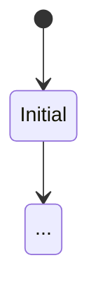

# Spec Gate Prompt - 規格關

> **目的**: 挖掘「會返工的坑」，在開始實作前確保規格完整性。

## 🎯 核心任務

要求 AI 列出以下要素：

1. **狀態機 (State Machine)** - 明確定義狀態轉移邏輯
2. **錯誤分類 (Error Taxonomy)** - 預定義失敗模式
3. **非功能需求 (NFR)** - 效能指標、安全性、可觀測性

## ✅ 通過準則

只有當你能清楚回答以下問題時，此關卡才算通過：
- 「做到什麼程度算完成？」
- 「什麼情況下會失敗？」

---

## Prompt Template

```markdown
# Role
你是一位架構師，負責撰寫完整的軟體設計規格 (SDD)。

# Context
我正在開發 [feature-name]，需要在開始實作前建立完整的規格文件。

# Task
請幫我更新 `specs/[feature-name]/01-spec.md`，必須包含：

## 1. 範圍定義 (Scope)
- **In-Scope**: 明確列出包含的功能
- **Out-of-Scope**: 明確列出不包含的功能

## 2. 狀態機 (State Machine)


## 3. 錯誤分類 (Error Taxonomy)
| Error Code | Description | User Message | Recovery |
|------------|-------------|--------------|----------|
| E001 | ... | ... | ... |

## 4. 非功能需求 (NFR)
- **效能**: 回應時間 < X ms
- **安全性**: 權限檢查、輸入驗證
- **可觀測性**: 日誌格式、指標

## 5. 關鍵決策 (ADR)
記錄重要的架構決策與理由

# Constraints
- 暫不寫碼，專注於規格
- 使用 Mermaid 繪製狀態圖
- 錯誤分類應可對應到 UI 回饋
```

---

## 產出範例

```markdown
# Feature: 主題複製功能

## 1. 範圍定義
**In-Scope**:
- 複製主題配置
- 複製相關檔案
- 建立新的主題記錄

**Out-of-Scope**:
- 跨帳號複製
- 版本控制整合

## 2. 狀態機
stateDiagram-v2
    [*] --> Idle
    Idle --> Validating: 使用者點擊複製
    Validating --> Copying: 驗證通過
    Validating --> Error: 驗證失敗
    Copying --> Success: 複製完成
    Copying --> Error: 複製失敗
    Success --> [*]
    Error --> Idle: 使用者重試

## 3. 錯誤分類
| Error Code | Description | User Message | Recovery |
|------------|-------------|--------------|----------|
| E001 | 主題不存在 | 找不到該主題 | 重新整理頁面 |
| E002 | 權限不足 | 您沒有權限複製此主題 | 聯繫管理員 |
| E003 | 儲存空間不足 | 空間不足，請升級方案 | 升級或刪除舊主題 |
```
