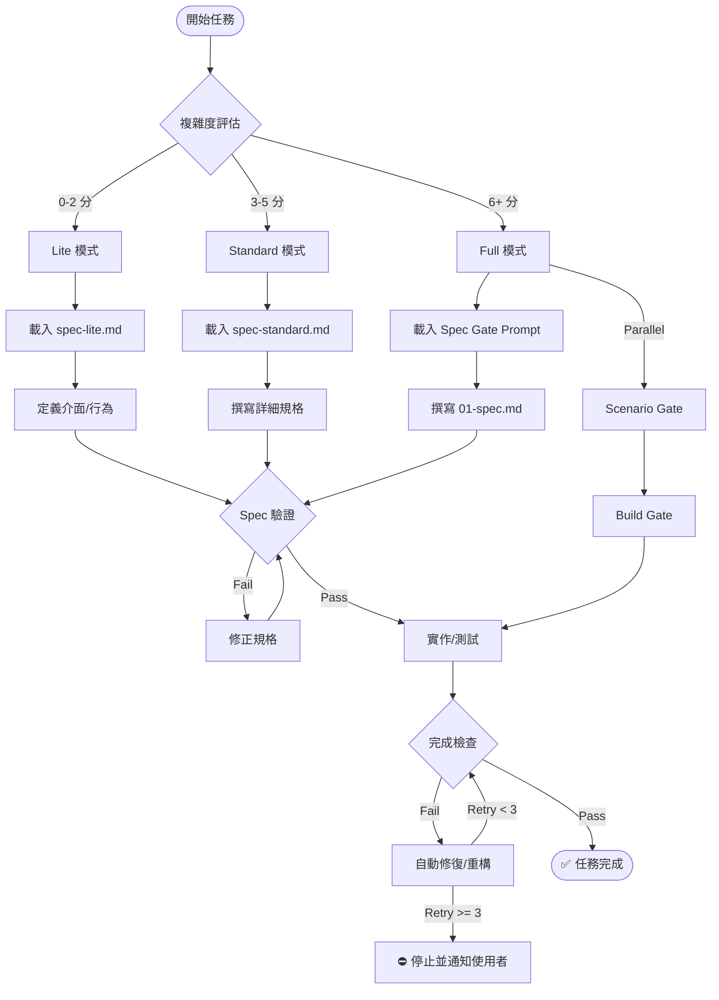

# 執行流程與 Checkpoints (Execution Flow)

> **目的**: 明確定義工作流程的執行順序、檢查點 (Checkpoints) 與失敗回退機制。

---

## 🚦 完整流程圖



---

## 🛑 檢查點詳解 (Checkpoints)

### Checkpoint 1: Spec 驗證 (Spec Gate)

**時機**: 規格文件撰寫完成後，開始寫程式碼之前。

**執行指令**:
```bash
./scripts/validate-spec.sh <spec-file> <mode>
```

**通過條件**:
- 檔案存在
- 必要區塊 (Section) 存在且內容不為空
- 模式正確符合預期

**失敗處理**:
- ❌ **禁止進入實作階段**
- 必須補全缺失的規格章節

---

### Checkpoint 2: 完成檢查 (Build Gate)

**時機**: 程式碼實作完成，準備標記任務為 Done 時。

**執行指令**:
```bash
./scripts/check-finish.sh [all|lint|test]
```

**通過條件**:
- TypeScript 編譯無錯誤 (`tsc --noEmit`)
- ESLint 無嚴重錯誤
- 相關測試案例通過

**失敗處理**:
- 進入「修復循環」
- 若使用 Claude Code: 觸發 `ralph loop`
- 若連續失敗 3 次: 停止迭代，請求使用者介入

---

## 🔄 回退與恢復 (Rollback & Recovery)

### 場景 1: 實作發現規格漏洞
如果在實作階段發現 API 介面不可行或遺漏邊界條件：
1. **暫停實作**
2. 回到 **Spec Gate**
3. 更新 `spec.md`
4. 重新執行 `validate-spec.sh`
5. 恢復實作

### 場景 2: 無法滿足 Lint 要求
如果 `check-finish.sh` 持續失敗且無法修復：
1. 在 spec 中記錄此為「已知限制」或「待修復項目」
2. 通知使用者並獲得批准
3. 使用 `// @ts-ignore` 或類似機制暫時繞過（需註解原因）
4. 建立後續修復的 Issue/Todo

---

## ⚡️ 快速參照

| 階段 | 關鍵動作 | 驗證工具 | 失敗後果 |
|-----|---------|---------|---------|
| **評估** | 決定模式 | 00-complexity-gate.md | 選擇錯誤的 overhead |
| **規格** | 撰寫文件 | `validate-spec.sh` | **禁止實作** |
| **實作** | TDD/Coding | `check-finish.sh` | 重構或回退 |
