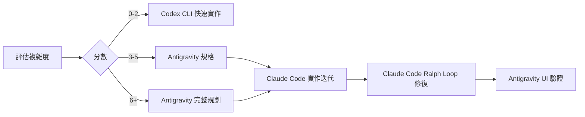
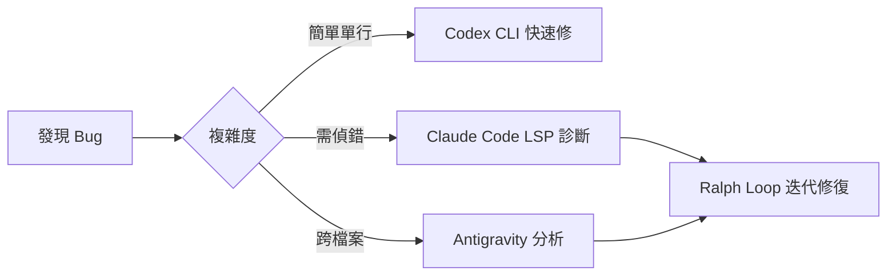

# AI Agent 使用策略詳解

> **目的**: 根據不同 AI Agent 的特性，選擇最有效率的工具組合。

---

## 🤖 Agent 特性比較

### Antigravity (Gemini-based)

**強項**:
- 超長上下文視窗 (1M+ tokens)
- 多檔案同時編輯
- 複雜規劃與設計
- 瀏覽器自動化測試

**弱項**:
- 無內建迭代循環
- 需要手動驗證

**最佳使用場景**:
```
✅ 撰寫完整規格文件
✅ 跨多檔案重構
✅ 複雜的 implementation plan
✅ UI 測試與截圖驗證
✅ 需要大量上下文的任務
```

**使用技巧**:
```
1. 善用 task_boundary 追蹤進度
2. 使用 browser_subagent 驗證 UI
3. 一次處理多個相關文件
4. 產出 walkthrough.md 作為驗證紀錄
```

---

### Claude Code

**強項**:
- LSP 診斷整合 (0-Token 錯誤偵測)
- Ralph Loop 自動迭代
- Patch-only 模式省 Token
- 精確的程式碼修改

**弱項**:
- 上下文視窗較小
- 需要明確的 finish condition

**最佳使用場景**:
```
✅ 自動修復 lint/type 錯誤
✅ 迭代式 bug 修復 (Ralph Loop)
✅ 精確的單檔修改
✅ 需要 LSP 診斷的任務
```

**使用技巧**:
```bash
# 1. 設定明確的完成條件
ralph loop "修復所有 TypeScript 錯誤" --max-iterations 10

# 2. 使用 Patch-only 減少 Token 消耗
# 在 .claude/settings.json 設定 "patch_only": true

# 3. 避免使用 Ralph Loop 的場景
# ❌ "讓介面更好看" (無客觀標準)
# ❌ "優化效能" (無明確指標)
```

---

### Codex CLI (OpenAI)

**強項**:
- 快速單次生成
- 輕量級指令
- 無需複雜設定

**弱項**:
- 不適合複雜任務
- 無迭代能力
- 上下文有限

**最佳使用場景**:
```
✅ 快速生成單一函數
✅ 簡單的程式碼片段
✅ 一次性小修改
✅ 快速原型驗證
```

**使用技巧**:
```bash
# 1. 保持任務簡單
codex "建立一個 formatDate 工具函數"

# 2. 配合已有規格
codex "根據 specs/formatter/spec-lite.md 實作 formatDate"

# 3. 分解複雜任務
codex "第一步：建立型別定義"
codex "第二步：實作核心邏輯"
```

---

## 📋 任務分配矩陣

| 任務類型 | 首選 Agent | 備選 Agent |
|---------|-----------|-----------|
| 規格撰寫 | Antigravity | - |
| Implementation Plan | Antigravity | Claude Code |
| 新增元件 | Antigravity | Codex CLI |
| Bug 修復 (簡單) | Codex CLI | Claude Code |
| Bug 修復 (複雜) | Claude Code | Antigravity |
| Lint 錯誤修復 | Claude Code (Ralph) | - |
| 多檔重構 | Antigravity | - |
| 測試撰寫 | Antigravity | Claude Code |
| 快速原型 | Codex CLI | - |
| UI 驗證 | Antigravity | - |

---

## 🔄 協作工作流範例

### 範例 1: 新功能開發



### 範例 2: Bug 修復



---

## ⚠️ 成本控制提醒

### Token 消耗排名

1. **最省**: Claude Code (Patch-only + LSP 0-Token 診斷)
2. **中等**: Codex CLI (單次生成)
3. **最貴**: Antigravity (長上下文)

### 省錢策略

```
1. 簡單任務用 Codex CLI
2. 迭代修復用 Claude Code Ralph Loop
3. 複雜規劃用 Antigravity (一次到位)
4. 避免讓任何 Agent 做「美感探索」類任務
```

---

## 📚 相關文件

- [SKILL.md](../SKILL.md) - 主入口文件
- [00-complexity-gate.md](../00-complexity-gate.md) - 複雜度評估
- [04-commands.md](../04-commands.md) - 各模式指令
