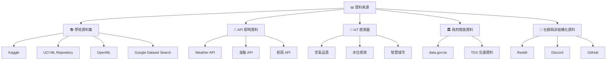
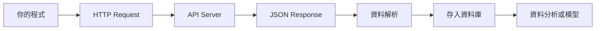
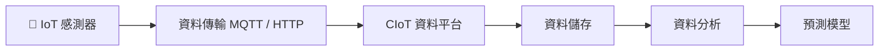
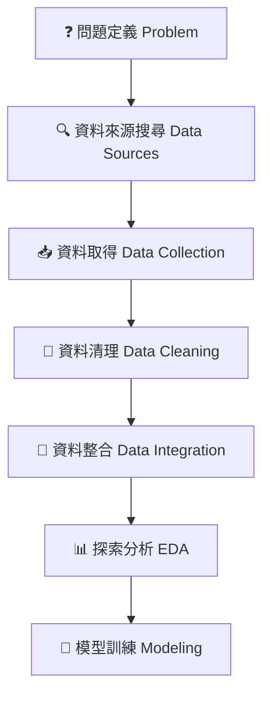
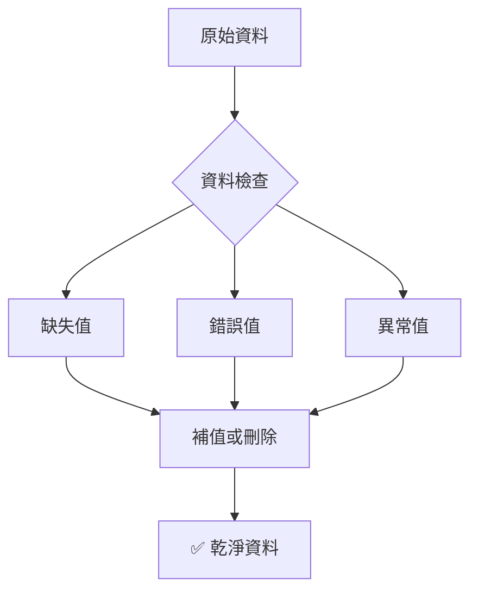
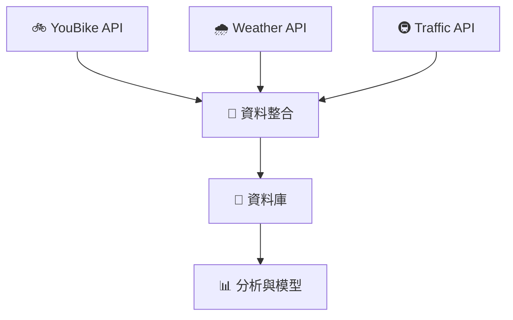
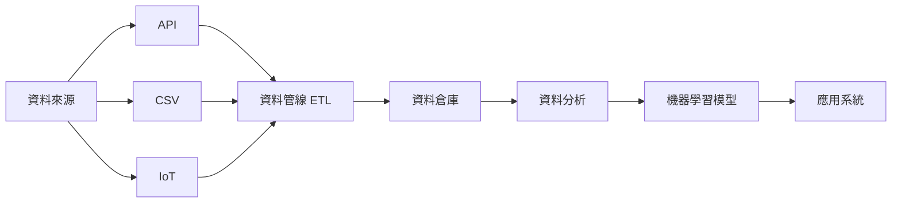
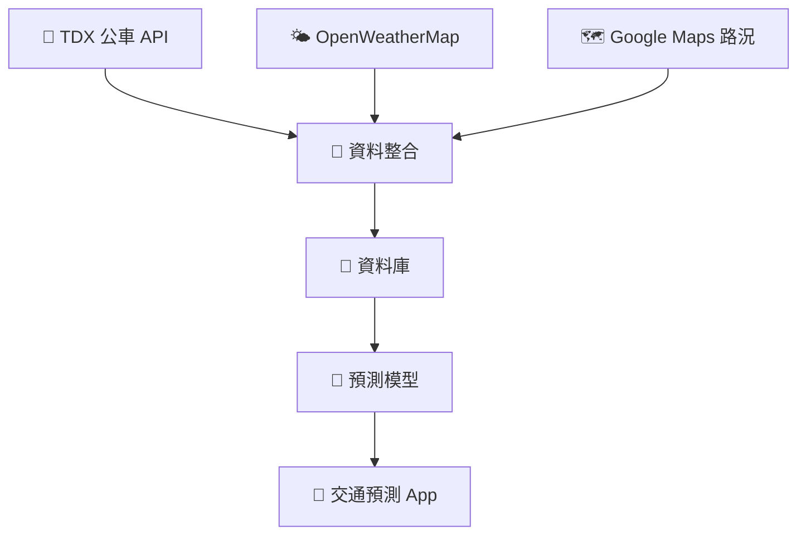

# 資料收集（Data Collection）

> **🧠 你的大腦在想：**「資料科學不就是寫模型嗎？為什麼要花一整章講資料收集？」
>
> 因為在真實世界裡，**80% 的時間其實花在取得與整理資料。** 模型再厲害，餵進去的是垃圾，出來的也是垃圾。

---

## 💡 在你開始之前

翻開任何一本資料科學教科書，你會看到這樣的流程：

```
問題定義
    ↓
資料收集      ← 你現在在這裡！
    ↓
資料清理
    ↓
探索式分析 (EDA)
    ↓
模型建立
    ↓
部署與決策
```

注意到了嗎？**資料收集是第二步**，比模型建立早了三步。

這不是偶然。

---

## 🎯 本章目標

讀完這一章，你會知道：

- 為什麼資料收集比選擇演算法更重要
- 五種主要的資料來源分類
- 如何使用 API 取得即時資料
- 台灣有哪些獨特的開放資料資源
- 資料收集的五大原則

---

# 🎬 情境故事：先聽故事，再學知識

> **Head First 風格提醒：** 你的大腦喜歡故事，不喜歡條列式清單。所以我們先從幾個真實故事開始，讓你「感受」資料收集為什麼重要。

---

## 故事 1：消失的預測模型

某天早上，資料科學課的助教阿哲興奮地跑進教室。

「老師，我做出一個**股價預測模型**！」

他把筆電投影到螢幕上。

```
模型準確率：92%
```

全班同學都很驚訝。「哇，這麼高？」

老師問：

> 「你用什麼資料？」

阿哲回答：「我從某個網站抓了 10 年的股價資料。」

老師看了一下資料。過了幾秒，他笑了。

「阿哲，你這個模型**不能用**。」

阿哲愣住了。「為什麼？」

老師指出一個問題：

> 你的資料只有「交易日」，但沒有「停牌日」。

於是模型學到一個錯誤規律：

```
每次停牌後 → 股價都會上漲
```

但其實原因只是——**停牌的資料被刪掉了**。

老師說了一句資料科學界的名言：

> **🗑️ Garbage in, garbage out.**
>
> （垃圾資料進去，垃圾結果出來。）

```
┌─────────────────────────────────────┐
│  🧠 大腦記重點                        │
│                                     │
│  資料收集錯誤 → 模型結果錯誤             │
│  這不是模型的問題，是「資料」的問題。       │
└─────────────────────────────────────┘
```

---

## 故事 2：失敗的空氣品質預測

某城市想做一個 AI 系統，預測 PM2.5。

工程團隊收集了資料：溫度、濕度、風速。

模型準確率只有 **55%**。團隊非常困惑。

後來一位環境科學家加入專案。他看了資料後說：

「你們少了一個最重要的變數。」

大家問：「什麼？」

他回答：**風向**。

因為 PM2.5 常來自其他城市（例如中國 → 台灣）。

加入風向資料後，模型準確率變成 **82%**。

> **💡 教訓：好的資料比好的演算法更重要。**

---

## 故事 3：YouBike 的資料科學家

台北市政府希望解決一個問題：**YouBike 常常被借光**，特別是捷運站附近。

資料科學團隊收集了：YouBike 即時數量、借車時間、站點位置。

模型預測早上 8:00 台大醫院站會車輛短缺。但系統仍然預測錯誤。

後來工程師發現，缺了一種資料：**天氣**。

下雨時，借車量會下降 60%。

加入天氣資料後，預測準確率大幅提升。最終模型使用：

```
YouBike API + 天氣 API + 捷運出站資料
```

> **💡 教訓：資料整合（Data Integration）是資料科學的重要能力。**

---

## 故事 4：Kaggle 冠軍的秘密

一場 Kaggle 比賽：預測房價。

很多人使用 Random Forest、XGBoost、Neural Network。

但最後冠軍的模型其實很簡單。他只做了兩件事：

**第一件事**：收集更多資料（房屋年齡、附近學校、犯罪率）

**第二件事**：修正資料錯誤（例如「房屋面積 = 0」其實是缺失值）

最後，他只用了 **Linear Regression**，卻打敗所有深度學習模型。

> **💡 教訓：資料品質比模型複雜度更重要。**

---

## 故事 5：IoT 感測器的騙局

某工廠導入 AI 系統預測機器故障。資料來源是溫度、震動、電流。

模型預測：**機器故障率下降 70%**。看起來非常成功。

但三個月後，機器突然大量故障。

調查後發現：**感測器壞了**。感測器回傳固定值，AI 模型以為機器非常穩定。

> **💡 教訓：資料收集需要資料品質監控。**

---

```
┌─────────────────────────────────────────────┐
│  📝 小測驗（先別偷看答案！）                     │
│                                             │
│  請判斷以下哪個是「資料收集問題」：               │
│                                             │
│  A. 模型準確率只有 50%                         │
│  B. 股價資料缺少停牌資料                        │
│  C. API 每天只更新一次，但模型需要即時資料         │
│                                             │
│  答案：B 和 C 都是「資料收集問題」               │
│  A 可能是模型問題，也可能是資料問題，需要進一步分析  │
└─────────────────────────────────────────────┘
```

---

# 🗺️ 資料來源全景圖

> **🧠 你的大腦在想：**「好，我知道資料很重要了。但資料到底從哪裡來？」

現代資料科學的資料來源可以分為五大類：



接下來，我們逐一深入每一類。

---

# 一、📚 學術與研究資料集

> 學術資料集就像是「練功房裡的沙包」——結構乾淨、定義明確，非常適合練習和學習。

學術資料集通常用於：教學、演算法比較、benchmark 測試。

---

## Kaggle Datasets

全球最大的資料科學平台，數十萬個社群貢獻的真實世界資料集。

🔗 [kaggle.com/datasets](https://www.kaggle.com/datasets)

常見格式：CSV、JSON、Parquet、SQL

| 資料集 | 應用 |
|--------|------|
| Titanic | 生存預測（入門經典） |
| House Prices | 房價回歸 |
| Credit Card Fraud | 詐欺偵測 |

```python
import pandas as pd

df = pd.read_csv("titanic.csv")
df.head()
```

```
┌──────────────────────────────────────┐
│  🏋️ 練習時間                          │
│                                      │
│  去 Kaggle 搜尋 "taiwan" 或 "taipei" │
│  看看有哪些和台灣相關的資料集？          │
└──────────────────────────────────────┘
```

---

## UCI Machine Learning Repository

最經典的學術資料庫之一，資料結構嚴謹、欄位定義清楚，適合教學。

🔗 [archive.ics.uci.edu](https://archive.ics.uci.edu/)

| 資料 | 任務 |
|------|------|
| Iris | 分類（資料科學界的 Hello World） |
| Wine | 多類別分類 |
| Breast Cancer | 醫療分類 |

---

## OpenML

OpenML 的特色是**可重現研究**——將資料集、演算法與實驗結果結合在一起。

🔗 [openml.org](https://www.openml.org/)

可以直接用 Python API 調用：

```python
import openml

dataset = openml.datasets.get_dataset(61)
X, y, _, _ = dataset.get_data(target=dataset.default_target_attribute)
```

---

## Google Dataset Search

> 把它想成**「資料集版 Google」**。

🔗 [datasetsearch.research.google.com](https://datasetsearch.research.google.com/)

搜尋來源包括大學、研究機構、政府、NGO。

試試搜尋：`climate change dataset` 或 `taiwan population dataset`

---

# 二、🤖 LLM 與 NLP 資料

> **🧠 你的大腦在想：**「ChatGPT 用什麼資料訓練的？」好問題！大型語言模型需要「大量」文本資料。

---

## Hugging Face Datasets

目前 AI 領域最重要的資料庫，也是 AI 界的標準入口。

🔗 [huggingface.co/datasets](https://huggingface.co/datasets)

| 資料 | 用途 |
|------|------|
| Wikipedia | 語言模型預訓練 |
| Common Crawl | 網頁語料 |
| ShareGPT | 對話訓練 |
| Dolly | 指令微調 |

```python
from datasets import load_dataset

dataset = load_dataset("wikipedia", "20220301.en")
```

---

## LMSYS Chatbot Arena

包含真實「人類 ↔ LLM」對話資料。

🔗 [lmsys/chatbot_arena_conversations](https://huggingface.co/datasets/lmsys/chatbot_arena_conversations)

用途：模型評估、alignment 研究、prompt engineering

---

## Papers with Code

特色：**論文 + 資料 + 程式碼**，三合一。

🔗 [paperswithcode.com/datasets](https://paperswithcode.com/datasets)

可以找到 SOTA 模型和 benchmark dataset，例如：ImageNet、COCO、GLUE

---

# 三、🎙️ 語音與音訊資料

> 語音 AI 需要大量聲音資料。以下是三個最重要的來源。

---

## Mozilla Common Voice

全球最大開源語音資料，多語言，包含**繁體中文**。

🔗 [commonvoice.mozilla.org](https://commonvoice.mozilla.org/)

主要用途：ASR（語音轉文字）

---

## LibriSpeech

來自 LibriVox 有聲書，是 ASR 的標準 benchmark。

🔗 [openslr.org/12](https://www.openslr.org/12)

---

## AudioSet

Google 建立的音訊資料集——超過 200 萬段 YouTube 音訊，標註 632 類聲音。

🔗 [research.google.com/audioset](https://research.google.com/audioset/)

例如：狗叫、汽車、雷聲、鍵盤聲……

---

# 四、🔌 即時 API 資料來源

> **🧠 你的大腦在想：**「CSV 檔案我懂，但什麼是 API？」
>
> 簡單說：API 就是「程式跟程式之間的溝通管道」。你發一個 request，它回你一個 JSON。



---

## OpenWeatherMap

IoT 專案最常串接的氣象 API。

🔗 [openweathermap.org](https://openweathermap.org/)

提供：溫度、濕度、降雨、風速，精確到分鐘的降水預報。

```python
import requests

url = "https://api.openweathermap.org/data/2.5/weather?q=Taipei&appid=YOUR_API_KEY"
data = requests.get(url).json()
print(data)
```

```
┌──────────────────────────────────────────┐
│  ⚠️ 注意                                 │
│                                          │
│  API_KEY 不要放進 Git！                   │
│  使用 .env 檔案或環境變數管理你的金鑰。     │
└──────────────────────────────────────────┘
```

---

## Aviationstack

全球航班即時狀態、機場與航線數據。

🔗 [aviationstack.com](https://aviationstack.com/)

用途：航空分析、物流研究

---

## Financial Modeling Prep

高頻率股市、經濟指標與公司財報 API，文檔與測試介面為業界標竿。

🔗 [financialmodelingprep.com](https://financialmodelingprep.com/)

適合：金融模型、投資研究

---

## Unified.to

「統一 API」平台，將數百個 SaaS（CRM、HR、會計系統）整合進單一接口。

🔗 [unified.to](https://unified.to/)

適合開發 RAG 工具跨系統資料對接。

---

# 五、🇹🇼 台灣政府與 IoT 資料

> 台灣是亞洲少數大量開放資料的國家。這些資料**免費、合法、品質不錯**——身為台灣的學生，不用白不用！

---

## data.gov.tw

台灣政府資料開放平台，提供：人口、環境、交通、醫療等資料。

🔗 [data.gov.tw](https://data.gov.tw/)

---

## 民生公共物聯網（CIoT）

台灣最完整的 IoT 資料集來源。

🔗 [ci.taiwan.gov.tw/dsp](https://ci.taiwan.gov.tw/dsp/)

| 類型 | 例子 |
|------|------|
| 空氣品質 | PM2.5 微型感測器即時數值 |
| 水資源 | 河川水位、淹水感應器 |
| 地震 | 感測器資料 |
| 電力 | 台電負載與發電即時統計 |

這些資料是**即時資料流**——和靜態 CSV 完全不同：



---

## TDX 交通資料平台

全台所有交通載具的靜態與即時動態 API。

🔗 [tdx.transportdata.tw](https://tdx.transportdata.tw/)

包含：捷運、公車、高鐵、台鐵

可建立：交通預測、路線推薦系統

---

## 台北市政府資料開放平台

台灣各縣市中 API 化最成熟的平台。

🔗 [data.taipei](https://data.taipei/)

包含 YouBike 即時站位數、公車動態等。

---

# 六、💰 金融與經濟資料

> 金融資料是資料科學最重要的應用領域之一。台灣市場有獨特的官方資源。

---

## 台灣市場

| 資源 | 說明 |
|------|------|
| [臺灣證券交易所 OpenAPI](https://openapi.twse.com.tw/) | 每日收盤行情、上市公司基本資料、董監事持股，JSON 格式，免註冊 |
| [證券櫃檯買賣中心 OpenAPI](https://www.tpex.org.tw/openapi/) | 上櫃、興櫃、創櫃及債券交易資訊 |
| [FinMind 台股數據 API](https://finmind.github.io/) | 開源專案，封裝台股複雜數據，提供 Python SDK（[GitHub](https://github.com/FinMind/FinMind)） |
| [永豐 Shioaji API](https://sinotrade.github.io/) | 即時行情（毫秒級）與自動化交易 SDK |
| [元大證券 API](https://www.yuanta.com.tw/eyuanta/Securities/DigitalArea/ApiOrder) | 即時行情與程式交易下單 API |

---

## 全球市場

| 資源 | 說明 |
|------|------|
| [Financial Modeling Prep](https://financialmodelingprep.com/) | 股價與極詳細財報，適合開發會計 AI 或投資研究 RAG |
| [Twelve Data](https://twelvedata.com/) | 整合股市、加密貨幣與外匯，WebSocket 支持強大 |
| [Alpha Vantage](https://www.alphavantage.co/) | 老牌穩定，提供多種技術指標（SMA、RSI 等）的直接計算結果 |

---

## 總體經濟

### FRED 經濟資料庫

全球最大的總體經濟資料，含 80 萬個數據系列。

🔗 [fred.stlouisfed.org](https://fred.stlouisfed.org/)

包括：GDP、CPI、利率、就業率

```python
from fredapi import Fred

fred = Fred(api_key='YOUR_API_KEY')
gdp = fred.get_series('GDP')
```

| 資源 | 說明 |
|------|------|
| [Yahoo Finance (yfinance)](https://github.com/ranaroussi/yfinance) | 非官方 API，透過 `yfinance` 抓取歷史 K 線，免費且適合策略回測 |
| [Quandl / Nasdaq Data Link](https://data.nasdaq.com/) | 另類數據（航運、大宗商品庫存），適合深入研究模型 |

---

# 七、👨‍💻 開發者行為資料

> 另一個重要資料來源是**開源社群行為**——誰在寫什麼程式、什麼技術在流行。

---

## GitHub Archive

記錄 GitHub 上所有事件：Star、Issue、Pull Request、Commit。

🔗 [gharchive.org](https://www.gharchive.org/)

可以研究技術趨勢與開源生態。例如：Supabase 的成長速度。

---

## Stack Exchange Data Explorer

可用 SQL 查詢 Stack Overflow 所有問答。

🔗 [data.stackexchange.com](https://data.stackexchange.com/)

```sql
SELECT TOP 10 Tags.TagName, COUNT(*) as Count
FROM Posts
JOIN PostTags ON Posts.Id = PostTags.PostId
JOIN Tags ON Tags.Id = PostTags.TagId
GROUP BY Tags.TagName
ORDER BY Count DESC
```

---

## GHTorrent

GitHub 鏡像數據，適合研究開源專案的演進邏輯。

🔗 [ghtorrent.org](https://ghtorrent.org/)

> ⚠️ 注意：2019 年後資料有缺口。

---

# 八、🌍 空間與地理資料

> 地理資料是許多應用的核心——從外送路線到森林火災監測。

---

## OpenStreetMap

可以取得全球的道路、建築、商店、地標。

🔗 [openstreetmap.org](https://www.openstreetmap.org/) / [Overpass Turbo](https://overpass-turbo.eu/)

例如查詢：台灣所有露營區

---

## Sentinel 衛星資料

歐洲航天局衛星影像。

🔗 [sentinel-hub.com](https://www.sentinel-hub.com/)

用途：森林監測、農業分析、氣候研究

---

# 九、💬 非結構化社群資料

> 很多有價值的資料隱藏在社群討論中——Reddit、Discord 裡的「人類語氣」是 LLM 訓練的寶貴素材。

---

## Reddit

🔗 [pushshift.io](https://pushshift.io/)（Reddit 歷史資料）

資料包括：貼文、留言、討論

可研究：社群情緒、技術趨勢

> ⚠️ Reddit 2023 年後限制 API，目前僅限已驗證版主申請存取。

---

## Discord

許多現代技術社群（MCP、Supabase、LangChain、AI Agents）的精華討論發生在 Discord。

透過自建 Bot 可以收集感興趣頻道的訊息（需合規），是建立**私有知識庫**的強大資料來源。

---

# 十、🔬 科學領域與特殊主題

| 資源 | 說明 |
|------|------|
| [NASA Open Data Portal](https://data.nasa.gov/) | 太空、地球科學及衛星遙測影像 |
| [PhysioNet](https://physionet.org/) | 生醫訊號（ECG、EEG）與臨床數據的權威來源 |
| [Registry of Open Data on AWS](https://registry.opendata.aws/) | 託管在 AWS 的大型資料集，包含基因組學、氣象衛星資料等 |
| [CIC Datasets](https://www.unb.ca/cic/datasets/index.html) | 最新 IoT 攻擊與安全資料集，用於 IoT 網路安全防護模型 |

---

# 十一、💼 商業與法律實體資料

> 對開發「會計 RAG」或「稅務自動化」至關重要。

| 資源 | 說明 |
|------|------|
| [台灣公司登記資料（經濟部）](https://data.gcis.nat.gov.tw/) | 即時驗證統一編號、登記狀態與資本額 |
| [OpenCorporates](https://opencorporates.com/) | 全球最大企業資料庫，超過 2 億家公司資料 |
| [司法院法學資料檢索系統](https://lawsearch.judicial.gov.tw/) | 裁判書開放資料，訓練法律 AI 的權威來源 |

---

# 十二、⛓️ 區塊鏈與鏈上資料

| 資源 | 說明 |
|------|------|
| [Dune Analytics](https://dune.com/) | 透過 SQL 查詢區塊鏈數據，可分析全球支付趨勢 |

---

# 🔧 資料收集的五大原則

> **🧠 你的大腦在想：**「知道資料在哪裡了，但收集的時候要注意什麼？」
>
> 以下五個原則，是你在做每一個資料科學專案時都要記住的。

---

## 原則 1：資料可靠性

資料來源必須可信。優先順序：

```
官方 > 學術 > 商業 API > 社群資料
```

例如股價資料：**TWSE > Yahoo Finance**

---

## 原則 2：資料完整性

資料應包含充分的後設資料（metadata）：時間、單位、欄位定義。

| ❌ 錯誤 | ✅ 正確 |
|---------|---------|
| price | closing_price |
| temp | temperature_celsius |

> 你未來的自己（或你的同學）看到 `price` 會問：「這是什麼的 price？哪個時間的 price？」

---

## 原則 3：資料可重現

研究必須可以重現。OpenML、Kaggle 都支援版本控制。

如果你的資料集沒辦法讓別人重現你的結果，那你的研究就沒有意義。

---

## 原則 4：資料合法性

資料收集**必須合法**。注意：

- 隱私權（個資法）
- API 使用條款
- 網站爬蟲規範（robots.txt）

```
┌──────────────────────────────────────────────┐
│  ⚠️ 重要提醒                                  │
│                                              │
│  不是所有網路上的資料都可以隨便抓。                │
│  爬蟲之前，先看 robots.txt 和使用條款。           │
│  違反可能會有法律責任。                           │
└──────────────────────────────────────────────┘
```

---

## 原則 5：資料更新頻率

不同應用需要不同的資料更新頻率：

| 任務 | 更新頻率 |
|------|---------|
| 金融交易 | 秒級 |
| 天氣預測 | 分鐘級 |
| 經濟研究 | 月 |
| 人口統計 | 年 |

> 如果你的模型需要即時資料，但 API 每天只更新一次，那你的模型一開始就輸了。

---

# 🏗️ 圖解：資料科學的完整資料流程

## 整體流程



| 步驟 | 說明 |
|------|------|
| Problem | 明確定義你要解決的問題 |
| Data Sources | 找到適合的資料來源 |
| Data Collection | 透過 API / CSV / 爬蟲取得資料 |
| Data Cleaning | 清理錯誤、缺失、異常資料 |
| Data Integration | 合併不同來源的資料 |
| EDA | 探索資料、發現規律 |
| Modeling | 建立機器學習模型 |

---

## 資料品質檢查流程

> 資料收集後一定要做 **Data Quality Check**，否則你就會變成故事裡的阿哲。



---

## 資料整合流程（多來源整合）

以 YouBike 預測為例，需要整合多個資料來源：



---

## 完整資料工程流程（現代資料科學）



---

# 🎯 實例：建立一個交通預測資料集

> 讓我們用一個具體案例，走一遍完整的資料收集流程。

**目標：建立「台北公車延誤預測模型」**



資料整合後的欄位可能包括：

| 欄位 | 來源 |
|------|------|
| 時間 | TDX API |
| 公車位置 | TDX API |
| 天氣（溫度、降雨） | OpenWeatherMap |
| 交通壅塞程度 | Google Maps |

最後形成一個完整的 **machine learning dataset**。

---

# 🧠 本章重點回顧

```
┌─────────────────────────────────────────────────────┐
│                                                     │
│  1. 資料品質 > 模型複雜度                              │
│                                                     │
│  2. 資料收集佔專案 60-80% 時間                         │
│                                                     │
│  3. 五種資料來源：                                     │
│     學術資料集 / API / IoT / 政府資料 / 社群資料        │
│                                                     │
│  4. 五大原則：                                        │
│     可靠性 / 完整性 / 可重現 / 合法性 / 更新頻率        │
│                                                     │
│  5. Garbage in, garbage out.                        │
│                                                     │
└─────────────────────────────────────────────────────┘
```

核心概念：

```
Data → Information → Knowledge → Decision
資料 → 資訊 → 知識 → 決策
```

> **下一步：** 學會收集資料之後，接下來就是「資料清理」——把你收集到的資料從「原始礦石」變成「可用的黃金」。
