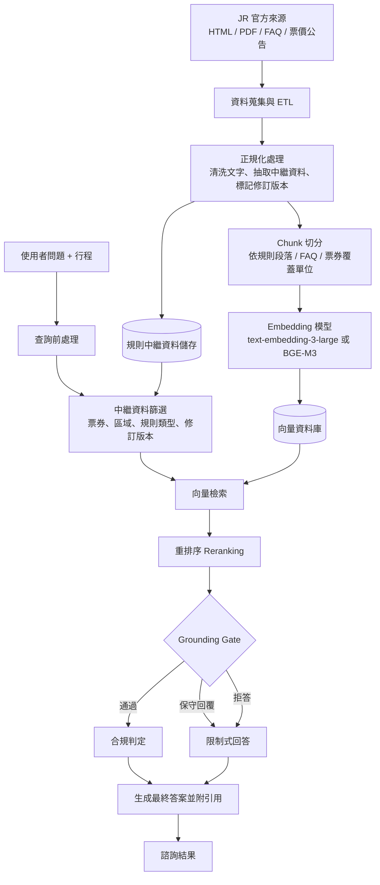

# JR Pass 官方規則與合規性 RAG 系統架構圖解

## 目標

建立一套以官方 JR Pass 與區域鐵道周遊券文件為知識來源的 RAG 系統，能回答票券資格、適用範圍、使用限制與合規性問題，並提供具引用依據的說明。

## 系統架構

## A. Data Ingestion（ETL）

### 資料來源範圍

- 官方 JR Pass 規則頁面
- 官方區域周遊券說明頁面
- 資格與限制條件頁面
- 官方 FAQ 與票價更新公告

### ETL 流程

1. 抓取官方來源文件。
2. 將 HTML、PDF、FAQ 內容正規化為乾淨文字。
3. 對每份文件與 chunk 抽取中繼資料：
   - `source_url`
   - `source_type`
   - `pass_name`
   - `pass_type`
   - `coverage_area`
   - `rule_category`
   - `revision_date`
   - `document_status`
4. 將文件切成可檢索的 chunk。
5. 產生 embedding，寫入向量資料庫。

## B. 非結構化資料到向量化資料的邊界

作業要求需要清楚標示資料從非結構化轉為向量化資產的界線，本系統的邊界如下。

### 邊界之前

- JR 官方 HTML 頁面
- PDF 公告
- FAQ 頁面
- 原始規則文字

### 邊界之後

- 已正規化的規則 chunks
- 結構化中繼資料
- 已寫入向量資料庫的 embedding 向量

此邊界位於 `Chunk 切分` 與 `Embedding 模型` 之間。

## C. Embedding Model 選擇

### 候選模型

- `text-embedding-3-large`
- `BGE-M3`

### 選型理由

- 若優先考量 API 一致性、多語檢索品質與整體穩定性，可選 `text-embedding-3-large`
- 若優先考量本地部署、成本控制或離線實驗，可選 `BGE-M3`

### 表徵需求

Embedding 模型必須能保留以下語意特徵：

- 票券名稱與別名
- 區域名稱與覆蓋範圍詞彙
- 規則與限制條件語意
- 票價、天數與有效期間概念
- FAQ 問句與條文之間的相似性

## D. Vector Database 拓樸

### 儲存設計

向量資料庫中的每筆 chunk 至少包含：

- chunk 文字
- embedding 向量
- chunk id
- parent document id
- 修訂版本中繼資料
- 規則分類中繼資料

### 必要篩選欄位

- `pass_name`
- `pass_type`
- `coverage_area`
- `rule_category`
- `revision_date`
- `document_status`

### 拓樸目標

- 支援向量相似度檢索
- 支援 revision-aware filtering
- 支援在 reranking 前先做規則類型縮限

## E. 檢索策略

### 基礎策略

- `Vector Retrieval + Metadata Filtering`

### 建議升級策略

- `Hybrid Search`
  - semantic similarity：處理使用者改寫過的自然語言問題
  - keyword match：處理票券名稱、站名、規則術語等精確字詞

### 檢索單位

- 視需要採用 `Parent-Document Retrieval`
  - 先抓細粒度 chunk
  - 保留上層規則文件上下文，供最終回答與 citation 使用

## F. Reranking 與 Grounding Gate

### Reranking 介入點

Reranking 位於初步檢索之後、答案生成之前，主要職責為：

- 依規則相關性重排 Top-N chunks
- 移除語意相近但實際無關的噪音片段
- 優先保留最新、最具權威性的官方規則片段

### Grounding Gate 介入點

Grounding Gate 位於 reranking 之後，用來判斷證據是否足以支撐回答：

- `pass`：證據充足，可生成附引用的回答
- `fallback`：證據部分充足，必須保守回答並附警告
- `block`：證據不足，禁止做出規則性主張

這是本系統抑制 hallucination 的核心檢查點。

## G. 合規判定層

本系統將「合規判定」與「文字生成」分開處理。

### 輸入

- 使用者行程
- 使用者問題
- 經 reranking 的官方證據片段

### 輸出

- 資格判定結果
- 使用限制摘要
- 缺失資訊警告
- 具證據依據的建議或拒答結果

## H. 回答生成

最終回答必須：

- 引用實際檢索到的官方規則
- 明確區分「官方規則依據」與「系統推估建議」
- 說明為何符合、受限或不建議使用某張票券
- 在證據不足時顯示警告或保守結論

## I. 效能與評估指標

- 檢索延遲目標：`p95 < 2500ms`
- 初步檢索深度：Top `10` chunks
- 最終引用數量：`1-5`
- 檢索品質目標：正確規則片段需出現在 Top-K 結果內
- 評估框架：使用 `RAGAS` 或 `TruLens` 評估忠實度、相關性與回答完整度

## 結論

這份架構圖解已涵蓋作業要求的四個重點：

- Data Ingestion / ETL
- Embedding Model 選擇
- Vector Database 拓樸
- 檢索策略

同時也清楚標示了：

- 非結構化資料轉向量化資料的邊界
- Reranking 的介入點
- Grounding Gate 的介入點
