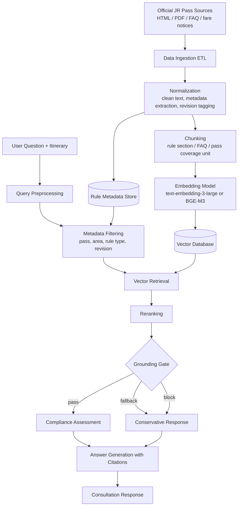

# JR Pass Official Rules & Compliance RAG Architecture

## Objective

Build a retrieval-augmented generation system that answers JR Pass eligibility, usage-rule, and compliance questions with grounded citations from official JR sources.

## System Architecture

## A. Data Ingestion (ETL)

### Source scope

- Official JR Pass rule pages
- Official regional pass descriptions
- Eligibility and restriction pages
- Official FAQ and fare update notices

### ETL pipeline

1. Fetch official source documents.
2. Normalize HTML, PDF, and FAQ content into clean text.
3. Extract metadata for each document and chunk:
   - `source_url`
   - `source_type`
   - `pass_name`
   - `pass_type`
   - `coverage_area`
   - `rule_category`
   - `revision_date`
   - `document_status`
4. Split documents into retrieval-ready chunks.
5. Generate embeddings and write chunks into the vector database.

## B. Unstructured-to-Vector Boundary

The architecture must clearly show where unstructured documents become vector-searchable assets.

### Before the boundary

- Raw JR HTML pages
- PDF notices
- FAQ pages
- Unstructured rule text

### After the boundary

- Normalized rule chunks
- Structured metadata
- Embedding vectors stored in the vector database

This boundary sits between `Chunking` and `Embedding Model`.

## C. Embedding Model Selection

### Candidate models

- `text-embedding-3-large`
- `BGE-M3`

### Decision rationale

- Prefer `text-embedding-3-large` when API consistency and multilingual retrieval quality are prioritized.
- Prefer `BGE-M3` when local inference or cost control is prioritized.

### Representation requirements

The embedding model must preserve:

- Pass names and aliases
- Coverage-area terminology
- Rule and restriction semantics
- Fare and validity concepts
- FAQ intent similarity

## D. Vector Database Topology

### Storage design

Use a vector store with metadata filtering support. Each chunk record contains:

- chunk text
- embedding vector
- chunk id
- parent document id
- revision metadata
- rule metadata

### Required filter dimensions

- `pass_name`
- `pass_type`
- `coverage_area`
- `rule_category`
- `revision_date`
- `document_status`

### Topology goal

- support similarity retrieval
- support revision-aware filtering
- support rule-category scoping before reranking

## E. Retrieval Strategy

### Baseline

- `Vector Retrieval + Metadata Filtering`

### Recommended upgrade

- `Hybrid Search`
  - semantic similarity for paraphrased user questions
  - keyword matching for exact pass names, station names, and rule phrases

### Retrieval unit

- Prefer `Parent-Document Retrieval` semantics when needed
  - retrieve fine-grained chunks first
  - keep parent rule context available for answer generation and citation display

## F. Reranking and Grounding Gate

### Reranking stage

Reranking sits after initial retrieval and before answer generation.

Its role is to:

- reorder top-N chunks by rule relevance
- reduce noisy but semantically similar chunks
- prioritize the most recent official rule evidence

### Grounding gate

The grounding gate sits after reranking.

It decides whether the system has enough trustworthy evidence to answer:

- `pass`: enough official evidence to answer with citations
- `fallback`: partial evidence, answer conservatively with warnings
- `block`: insufficient evidence, refuse to make a rule claim

This is the main hallucination-control checkpoint.

## G. Compliance Assessment Layer

Separate compliance assessment from plain generation.

Inputs:

- user itinerary
- user question
- reranked official evidence

Outputs:

- eligibility judgment
- restriction summary
- missing-information warnings
- evidence-backed recommendation or refusal

## H. Response Generation

The final answer must:

- cite retrieved official rules
- distinguish official rule statements from system inference
- explain why a pass is eligible, restricted, or not recommended
- surface warnings when evidence is incomplete

## I. Performance and Evaluation Targets

- Retrieval latency target: `p95 < 2500ms`
- Initial retrieval depth: top `10` chunks
- Final citation count: `1-5`
- Retrieval quality target: correct evidence appears in top-K results
- Evaluation plan: use `RAGAS` or `TruLens` for faithfulness, relevance, and answer completeness

## Summary

This architecture satisfies the assignment requirements by explicitly documenting:

- Data ingestion and ETL
- embedding model choice
- vector database topology
- retrieval strategy
- the boundary between unstructured content and vectorized knowledge
- the reranking and grounding intervention points
