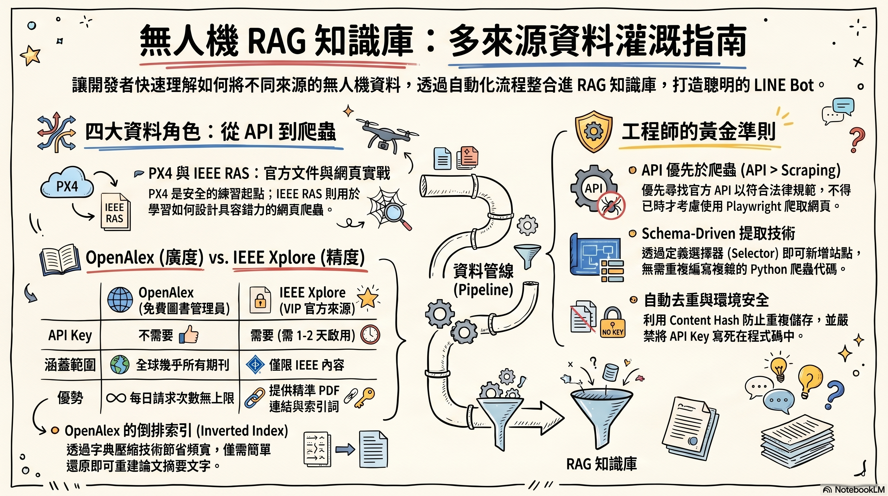

# ch10 — SPA 與動態內容爬取



> *當 `requests.get()` 拿到的是空殼，瀏覽器看到的卻是完整內容——*
> *這就是 SPA。本章教你怎麼處理。*

```
┌──────────────────────────────────────────────────────────────────┐
│                                                                  │
│   ch01–ch09 教你 Playwright 的所有基本功。                        │
│   ch10 給你一個特殊難題：                                          │
│                                                                  │
│       「網頁打開明明有內容，                                       │
│         為什麼我抓下來是空的？」                                   │
│                                                                  │
└──────────────────────────────────────────────────────────────────┘
```

## 🎯 你會學到

- ✅ 什麼是 **Single Page Application (SPA)**、為什麼傳統 `requests` 失效
- ✅ Playwright 的 **四種 wait_until 策略**：commit / domcontentloaded / load / networkidle
- ✅ 第五種「**手動等待元素**」為什麼通常是最佳解
- ✅ 把 SPA 案例（CBETA 佛典）接入 ch08 pipeline、寫入 Supabase
- ✅ SPA 站點 selector 設計的「**multi-fallback 容忍度**」

## 📂 章節檔案

| 檔案 | 主題 | 是否需 Supabase |
|------|------|-----------------|
| `01_static_vs_spa.py` | 概念對照：同一 URL，urllib vs Playwright 拿到什麼？ | ❌ 不需要 |
| `02_wait_strategies.py` | 對同個 SPA 跑五種等待策略，量測耗時與成功率 | ❌ 不需要 |
| `03_cbeta_ingest.py` | 把 CBETA B0067 接入 ch08 pipeline | ✅ 需要 |

建議先跑 01、02 理解概念，再做 03 整合。

---

## 🔍 為什麼 SPA 棘手？

```
┌─ 傳統靜態站（ch01-ch07 範例）──────────────────┐
│                                                  │
│   Browser ───→ GET /page                        │
│                  ↓                              │
│   Server ←───  完整 HTML（含所有內文）          │
│                  ↑                              │
│   requests / urllib 拿到的就是這個 ──── ✅       │
│                                                  │
└──────────────────────────────────────────────────┘

┌─ SPA（本章案例：CBETA）─────────────────────────┐
│                                                  │
│   Browser ───→ GET /page                        │
│                  ↓                              │
│   Server ←───  「空殼」HTML：                    │
│                <div id="app"></div>             │
│                <script src="bundle.js"></script>│
│                  ↓                              │
│   Browser 執行 JS → 發 XHR 拿真正內容            │
│                  ↓                              │
│   DOM 才開始有內容                              │
│                                                  │
│   requests / urllib 拿到的是空殼 ────── ❌       │
│   你需要的是「執行 JS 後」的 DOM                │
│                                                  │
└──────────────────────────────────────────────────┘
```

---

## 🧪 範例 01：眼見為憑

```bash
python ch10-spa/01_static_vs_spa.py
```

預期輸出（CBETA B0067_001）：

```
[A] 模擬 requests / urllib（不執行 JS）...
    HTML 長度：~5,000 字元
    含 '白話'：False

[B] Playwright 開瀏覽器執行 JS ...
    HTML 長度：~80,000 字元
    含 '白話'：True
```

差異大到讓你一輩子忘不了：**SPA 用靜態抓就是錯**。

---

## ⏱️ 範例 02：等待策略大車拚

```bash
python ch10-spa/02_wait_strategies.py
```

對同個 SPA 跑五種策略：

| 策略 | 速度 | 對 SPA 成功率 | 何時用 |
|------|------|----------------|--------|
| `commit` | 最快 | ❌ 幾乎抓不到 | 不要用 |
| `domcontentloaded` | 快 | ⚠️ 50/50 | 靜態 HTML |
| `load` | 中 | ✅ 通常可以 | 一般 SPA |
| `networkidle` | 慢 | ✅ 高 | 完全不知道頁面結構 |
| `domcontentloaded + wait_for_selector` | 中快 | ✅✅ 最高 | **生產推薦** |

**核心心法**：知道目標 selector 就用第五種，**精準 > 廣撒網**。

---

## 🔧 範例 03：CBETA 接入 ch08 pipeline

```bash
# 預設只抓 B0067 第 1 卷
python ch10-spa/03_cbeta_ingest.py

# 或抓多卷
python ch10-spa/03_cbeta_ingest.py --juans 1-5
python ch10-spa/03_cbeta_ingest.py --text-code T0001 --juans 1,2,3

# 啟動 worker 真的去爬
python -m utils.worker.main

# 驗收
python ch09-rag-bridge/04_end_to_end_demo.py
```

### 與 examples/drone_data/01_seed_px4_docs.py 的差異

```
            PX4 docs                   CBETA
            ─────────                  ─────
SPA 嗎？     假（Docusaurus 預渲染）   真（內容由 JS 載入）
wait_until   domcontentloaded          load（差別關鍵）
timeout      20s                       30s（給 JS 載入緩衝）
selector     單一 selector             multi-fallback OR
授權         CC-BY                     CBETA 自訂（限非商業）
```

---

## ⚠️ CBETA 授權須知

CBETA 內容**不是 Public Domain**，請遵守：

1. ✅ 個人 / 學術研究：可自由下載、複製、用於個人 RAG 知識庫
2. ✅ 須在引用 / 顯示時註明：來源「CBETA 中華電子佛典協會」+ 經號 + 版本日期
3. ❌ 禁止修改後重新發行
4. ❌ 禁止商業用途

詳細條款：https://cbetaonline.dila.edu.tw/zh/copyright

> **本章僅作教學示範**，請勿把抓下來的內容公開散布。
> 若你的應用是研究 / 個人助理 / 班級教學 → 沒問題。
> 若是商業產品 / 公開 SaaS → 你需要另外去信 CBETA 取得授權。

---

## 🆘 疑難排解

### 跑完 worker，articles 卻是空的

```
1. 開瀏覽器看 CBETA URL，按 F12 進 DevTools
2. Elements 分頁找實際的內文容器 class / id
3. 用該 selector 在 Console 跑：
     document.querySelectorAll("你的-selector").length
4. 若 ≥ 1 → 用此 selector 更新 03_cbeta_ingest.py 的
            ArticleExtractorSchema.content_selector
5. 重跑 03_cbeta_ingest.py（upsert 會更新 source 設定）
6. worker 再跑一次
```

### 範例 01 / 02 兩邊都拿不到內容

可能 CBETA 改版了關鍵字「白話」消失。改腳本中的 `CONTENT_KEYWORD`
為你能在頁面看到的中文字。

### 範例 02 `networkidle` 永遠 timeout

某些 SPA 會持續輪詢 server（heartbeat / analytics），網路永遠不安靜。
這就是 `wait_for_selector` 比 `networkidle` 可靠的最大理由。

### `wait_for_selector` 也 timeout

兩種可能：
- 你的 selector 寫錯（用 DevTools Console 驗證）
- 內容真的還沒出現（頁面壞了或網路太慢）—— 拉高 timeout 重試

---

## 📌 重點摘要

> 🎯 **SPA 必須執行 JS**，這是 Playwright 存在的最大理由。
>
> 🎯 **`wait_for_selector` 是生產推薦**，比任何 `wait_until` 都精準。
>
> 🎯 **Multi-fallback selector** 對結構不穩定的站點是救命符。
>
> 🎯 **看授權再爬**——CBETA 限非商業；個人 RAG OK，公開 SaaS 不行。
>
> 🎯 **遇到 0 結果 → 開 DevTools Console 驗 selector**，不要硬寫死。

---

## 🔁 下一步

完成本章後，你已掌握 ch00–ch10 完整爬蟲技能組合：

```
ch01-ch04   基礎瀏覽器自動化
   +
ch05        資料擷取與匯出
   +
ch06        Stealth / Session / Proxy
   +
ch07        測試
   +
ch08        Supabase Pipeline
   +
ch09        RAG Bridge
   +
ch10        SPA 與動態內容  ← 你現在在這
```

恭喜！接下來看 `examples/drone_data/` 把所學整合到一個無人機主題的
完整 RAG 系統，或寫自己的 ch11。
