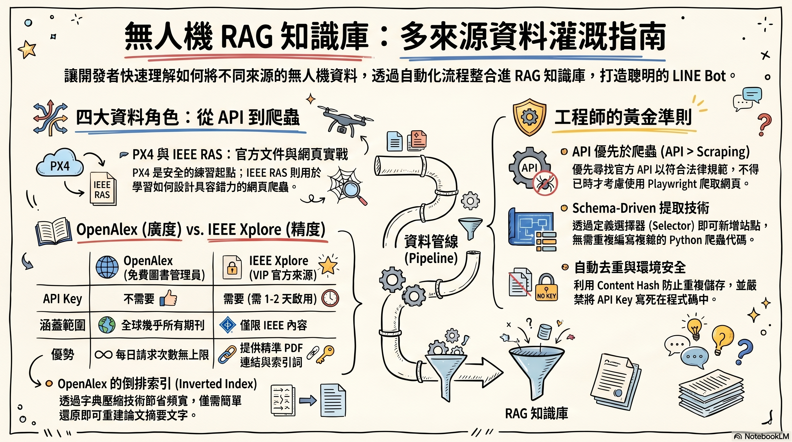

# drone_data — 把無人機資料灌進你的 RAG 知識庫



> *四個來源、四種路徑、一條 pipeline、一個 LINE Bot 能回答的問題。*

```
┌──────────────────────────────────────────────────────────────────┐
│                                                                  │
│   嗨！                                                            │
│                                                                  │
│   你要做的事很簡單：把網路上有關「無人機」的資料，               │
│   變成你的 LINE Bot 能回答的知識。                                │
│                                                                  │
│   聽起來複雜？別怕。你只需要四個指令，五分鐘。                    │
│                                                                  │
└──────────────────────────────────────────────────────────────────┘
```

---

## 🎯 你會學到什麼

讀完並跑完這份指南，你會：

- ✅ 知道**何時該用 Playwright、何時該用 REST API**（這是專業爬蟲工程師最重要的判斷）
- ✅ 學會**schema-driven extractor**——不寫 Python 也能新增爬取站點
- ✅ 親手把四種完全不同性質的資料灌進同一張 `articles` 表
- ✅ 看懂**為什麼 IEEE Xplore 搜尋頁不能爬，但 IEEE Xplore API 可以**
- ✅ 學會處理 API 的 `401 / 403 / 429`，並且**把 API key 安全地藏起來**

## 🚫 你不會學到什麼

- ❌ 怎麼破解 Cloudflare / reCAPTCHA（不要做，那是另一個世界）
- ❌ 怎麼大量爬付費內容（那是違法的，這份指南不教）
- ❌ 怎麼把 LINE Bot 從零搭起來（去 `project-linebot-rag-skills/` 看）

---

## 🗺️ 大局圖：你正在組裝這台機器

```
                  ┌────────────────────────────────────────┐
                  │      你的 Supabase 資料庫               │
                  │     ┌──────────────────────────┐       │
                  │     │   crawler.sources         │  ←──┐ │
                  │     │   ──────────────         │     │ │
                  │     │   • px4-docs              │     │ │
                  │     │   • ieee-ras              │     │ │
                  │     │   • openalex-drone        │     │ │
                  │     │   • ieee-xplore-drone     │     │ │
                  │     └─────────────┬─────────────┘     │ │
                  │                   │                   │ │
                  │                   ▼                   │ │
                  │     ┌──────────────────────────┐     │ │
                  │     │   crawler.articles        │  ←──┘ │
                  │     │                           │       │
                  │     │   你最終想要的東西。       │       │
                  │     │   title / abstract /      │       │
                  │     │   content_text / meta     │       │
                  │     └─────────────┬─────────────┘       │
                  └───────────────────┼─────────────────────┘
                                      │
                                      ▼
                          ┌────────────────────┐
                          │   ch09 RAG bridge   │
                          │   ──────────────   │
                          │   embed → 向量庫    │
                          │     → LINE Bot 回答 │
                          └─────────────────────┘
                                      ▲
                                      │
                       ┌──────────────┴──────────────┐
                       │  「PX4 的 flight modes      │
                       │    有哪些？」               │
                       │   ↑                         │
                       │  使用者問的問題             │
                       └─────────────────────────────┘
```

> **重點**：四支腳本各自把資料塞進 `articles`，最後合流到 RAG 一起被檢索。
> 你不必同時跑完四支，**先跑 PX4** 就有東西能讓 Bot 回答。

---

## 🎬 四個來源的故事

讓我們先把四個來源**人格化**一下。理解性格比記住程式碼重要。

### 角色 #1：PX4 — 模範生 📘

```
名稱：PX4 Autopilot Docs
網址：docs.px4.io/main/en/
個性：守規矩、結構穩定、CC-BY 授權「歡迎你來爬」
弱點：頁面很多，要爬一陣子
```

PX4 是開源無人機自駕儀的官方文件站，**爬它在道德與法律上都沒問題**。
這是你練習 Playwright + schema-driven extractor 的最佳起點。

### 角色 #2：IEEE RAS — 學會老牌網站 🎓

```
名稱：IEEE Robotics & Automation Society
網址：www.ieee-ras.org
個性：傳統 WordPress、結構不那麼穩定（會改版）
弱點：DOM 改了你的 selector 就壞了
```

這是真實世界的縮影：**你的爬蟲總有一天會因為網站改版而壞掉**。
所以這支範例的 selector 故意寫得「容忍多種版型」，讓你看到 fallback 怎麼設計。

### 角色 #3：OpenAlex — 免費的學術圖書館員 🆓

```
名稱：OpenAlex
網址：api.openalex.org
個性：完全免費、無 API key、慷慨地給你 metadata
弱點：abstract 是「字典壓縮」格式，你得自己重建文字
```

OpenAlex 涵蓋全球幾乎所有期刊論文（**包含 IEEE 收錄的**），是**取代爬蟲的合規捷徑**。
等下你會學到一個有趣的東西：`abstract_inverted_index`，看完保證你會「原來如此！」

### 角色 #4：IEEE Xplore — 戴著 VIP 手環的官方來源 🔑

```
名稱：IEEE Xplore Metadata Search API
網址：ieeexploreapi.ieee.org
個性：權威、精準、提供 PDF 連結與作者單位
弱點：要申請 API key、有每日 quota、status=waiting 時不能用
```

這支範例**取代了原本想直接爬 ieeexplore.ieee.org/search 的衝動**。
搜尋頁的 ToS 明確禁止自動化爬取——但官方提供 API 給你合法地拿同樣的資料。
**這是專業工程師的解法**：先找 API，找不到再考慮爬。

---

## ⚖️ 等等，03 跟 04 不是都拿 IEEE 論文嗎？

**Sharp Eye！** 對，但它們各有所長：

| 比較項 | 03 OpenAlex | 04 IEEE Xplore |
|--------|-------------|----------------|
| 需要 key？ | ❌ 不需要 | ✅ 需要（24 字元） |
| 每日 quota？ | 無限（polite pool 加 mailto 更快） | ~200 req/day |
| 涵蓋出版社 | 全球幾乎所有 | 只有 IEEE |
| Author affiliation | 部分 | 精準完整 |
| PDF 連結 | ❌ 沒有 | ✅ 有 `pdf_url` |
| IEEE 自訂索引詞 | ❌ 沒有 | ✅ `ieee_terms` |
| 廣度 vs 精度 | **廣度** | **精度** |

**建議用法**：先用 03 拉廣，再用 04 對 IEEE 部分補精度欄位。

---

## ⚡ 五分鐘上手：從零到 articles 落地

> 假設你已經完成 ch00 安裝、ch08 的 Supabase schema 套用了。
> 沒有？先去把這兩件事做完。

### Step 1 — 把環境變數準備好

```bash
cd project-playwright

# 第一次：安裝完整 deps（含 supabase, pandas, pytest）
uv pip install -e ".[all]"

# 複製 .env 範本
cp .env.example .env
```

打開 `.env`，填這三個（其他都可以不動）：

```bash
SUPABASE_URL=https://你的-project-ref.supabase.co
SUPABASE_SERVICE_KEY=eyJhbG...你的-service-role-key
PROJECT_ID=demo-project   # 隨便取，記得 ch09 也要用同一個
```

> 💡 **服務小提示**：`service_role` key 可繞過 RLS，**只在後端 worker 用**。
> 千萬別放進前端 / public repo / 螢幕截圖。

### Step 2 — 跑你的第一支爬蟲（PX4）

```bash
python examples/drone_data/01_seed_px4_docs.py
```

會看到：

```
============================================================
drone_data/01 — 將 PX4 docs 接入 crawler pipeline
============================================================
  project_id : demo-project
  code       : px4-docs
  crawler_url: https://docs.px4.io/main/en/

[OK] source 已 upsert：a3f2c1...
[OK] crawl_queue：新增 4 筆，已存在略過 0 筆

──────────────────────────────────────────────────────────
下一步：
  1. python -m utils.worker.main          # 啟動爬蟲 worker
  2. python ch09-rag-bridge/04_end_to_end_demo.py
```

**剛剛發生什麼事？**

```
   你執行了 01_seed_px4_docs.py
            │
            ▼
   ┌────────────────────────────┐
   │  STEP A: upsert sources    │
   │  ─────────────────────     │
   │  寫入一筆 source 設定到 DB │
   │  包含 extractor_schema     │
   │  （說明怎麼從 HTML 抽資料）│
   └────────────┬───────────────┘
                │
                ▼
   ┌────────────────────────────┐
   │  STEP B: enqueue 種子 URL  │
   │  ─────────────────────     │
   │  把 4 個入口 URL 塞進      │
   │  crawl_queue，狀態 pending │
   └────────────────────────────┘

   你還沒爬任何頁面！只是排好任務。
```

### Step 3 — 啟動 worker 真的去爬

```bash
python -m utils.worker.main
```

Worker 會：

```
   ┌─────────────────────────────────┐
   │  1. lease 一筆 pending 任務     │  ← 樂觀鎖，多個 worker 安全
   ├─────────────────────────────────┤
   │  2. Playwright 開瀏覽器導航       │  ← 阻擋 image/font 加速
   ├─────────────────────────────────┤
   │  3. 依 extractor_schema 抽資料   │  ← 不寫 Python 直接套設定
   ├─────────────────────────────────┤
   │  4. upsert 到 articles          │  ← content_hash 自動去重
   ├─────────────────────────────────┤
   │  5. 列表頁的新 URL 排回佇列      │  ← 邊爬邊發現
   └─────────────────────────────────┘
```

Worker 會持續跑直到 `MAX_EMPTY_POLLS`（連續 60 次空輪詢，約 5 分鐘）。
你可以隨時 `Ctrl+C` 停止——任務狀態用 token 鎖住，不會壞掉。

### Step 4 — 驗收

```bash
python ch09-rag-bridge/04_end_to_end_demo.py
```

看到 `total > 0` 就成功了。如果是零，跳到[疑難排解](#-疑難排解)。

---

## 🌈 把所有四支跑完

```bash
# 兩支 Playwright 來源（共用同一個 worker）
python examples/drone_data/01_seed_px4_docs.py
python examples/drone_data/02_seed_ieee_ras.py
python -m utils.worker.main                     # 跑直到佇列空

# 一支免費 API
python examples/drone_data/03_ingest_openalex.py

# 一支需要 key 的 API（等你的 IEEE key activate 之後）
# 先在 .env 加：IEEE_XPLORE_API_KEY=你的-24字元-key
python examples/drone_data/04_ingest_ieee_xplore.py

# 一次驗收全部
python ch09-rag-bridge/04_end_to_end_demo.py
```

---

## 🧠 削尖你的鉛筆：理解 schema-driven extractor

```
┌──────────────────────────────────────────────────────────────┐
│  練習：你要新增 "MIT News - Robotics" 這個來源。               │
│                                                              │
│  網站長這樣（簡化）：                                          │
│                                                              │
│    <main>                                                    │
│      <article class="news-card">                             │
│        <a href="/news/...">  ← 文章連結                       │
│          <h2>標題在這</h2>                                    │
│        </a>                                                  │
│      </article>                                              │
│      <article class="news-card">...</article>                │
│    </main>                                                   │
│                                                              │
│  問題：你的 ListExtractorSchema 應該怎麼設？                  │
│                                                              │
│  ┌─────────────────────────────────────┐                    │
│  │ item_selector  = ?                  │                    │
│  │ link_selector  = ?                  │                    │
│  │ title_selector = ?                  │                    │
│  └─────────────────────────────────────┘                    │
└──────────────────────────────────────────────────────────────┘
```

<details>
<summary>👉 點我看答案</summary>

```python
ListExtractorSchema(
    item_selector="article.news-card",   # 每筆的容器
    link_selector="a",                   # item 內部的連結
    title_selector="h2",                 # 標題在連結裡的 h2
)
```

**訣竅**：先找「重複出現的最小容器」，再用相對 selector 抓 link / title。

</details>

---

## 🎨 OpenAlex 的小魔術：inverted index 是什麼？

OpenAlex 為了**省頻寬**，把每篇論文的 abstract 用「字典壓縮」存：

```
原文："hello big world hello"

inverted_index = {
    "hello": [0, 3],   ← "hello" 出現在位置 0 和 3
    "big":   [1],      ← "big" 在位置 1
    "world": [2]       ← "world" 在位置 2
}
```

要重建文字，就把每個位置「填回字」，再從位置 0 排到最大：

```
位置 0 → "hello"
位置 1 → "big"
位置 2 → "world"
位置 3 → "hello"
        ↓
"hello big world hello"
```

`03_ingest_openalex.py:_rebuild_abstract()` 就是做這件事。
**為什麼這樣設計？** 因為很多論文的 abstract 包含重複的常見字，inverted index 壓縮率比原文還小，又可隨時還原。聰明吧！

---

## ❓ 沒有蠢問題

### Q: 我可以直接爬 ieeexplore.ieee.org/search 的搜尋頁嗎？

**A:** 技術上 Playwright 可以做到。法律上你會違反 IEEE 的 Terms of Service。
實務上你的 IP 會被封，更糟糕的是若你用機構網路，整個機構訂閱可能被收回。
**請用 04 號的官方 API**，它就是 IEEE 留給你的合規入口。

### Q: 為什麼 01 / 02 要先「種 source 再排佇列」，而 03 / 04 直接寫 articles？

**A:** 因為 01 / 02 是 HTML 爬蟲，需要 worker 去**真的開瀏覽器**抓頁面。
crawl_queue 是這個流程的「待辦清單」。
而 03 / 04 是 REST API ingest，**一個 HTTP 請求就拿到所有 metadata**，
沒有「待辦清單」的概念，直接 upsert 到 articles 即可。

### Q: source 是必須的嗎？我能不能跳過直接寫 articles？

**A:** `articles` 表有 `source_id` 外鍵約束，所以**必須有 source**。
這個設計是為了多租戶 + 可追溯——任何一筆 article 都能 join 回它來自哪個來源。
**好處**：日後你刪掉某個來源時，整批 articles 連帶刪除，乾淨俐落。

### Q: 我的 IEEE API key 一直 401，是不是壞了？

**A:** 99% 機率是 `status=waiting`。IEEE 通常**要 1-2 個工作天才會 activate**。
腳本會印出明確的提示——如果連明後天還是 401，再寫信去 ieee-developer。

### Q: PX4 有幾千頁，我會把資料庫塞爆嗎？

**A:** 不會。`articles` 表有 `content_hash` 去重——相同內容不會重複佔空間。
但**第一次全量爬大約要 30-60 分鐘**，建議用 `--source px4-docs` 限縮：

```bash
SOURCE_CODE=px4-docs python -m utils.worker.main
```

### Q: 我的 worker 一直跑沒結果，是不是 selector 寫錯？

**A:** 90% 機率是。看 worker 的 log，會印 `Schema-based list extracted N URLs`。
如果 N=0，就是 `item_selector` / `link_selector` 沒抓到東西。
解法：到該站用瀏覽器 DevTools（F12）的 Console 跑：

```javascript
document.querySelectorAll("你的 item_selector").length
```

如果是 0，selector 錯。如果有但 `link_selector` 內沒連結，也錯。

### Q: 我能不能加我自己的網站？

**A:** 可以！照 `01_seed_px4_docs.py` 的模式：
1. 複製一份命名 `99_seed_yoursite.py`
2. 改 `SourceInsert` 的 `code` / `crawler_url`
3. 改 `ExtractorSchema` 的三個 selector
4. 跑它 → worker → 驗收

---

## 🆘 疑難排解

### `ImportError: cannot import name 'AsyncClient' from 'supabase'`

你的 supabase-py 版本太舊。跑：

```bash
uv pip install --upgrade "supabase>=2.0"
```

### `Foreign key violation: articles.source_id`

`source` 沒種好。先跑 `01_seed_*.py` 再跑 worker。

### Worker 顯示 `Source not found in DB`

`PROJECT_ID` 不一致。檢查 `.env` 的 `PROJECT_ID` 和 seed 腳本印的 source row。

### `401 Unauthorized` from IEEE Xplore

```
[401/403] IEEE API 拒絕（Unauthorized）。
  常見原因：
    1. API key 仍為 'waiting' 狀態，未 activate
    2. 每日 quota 用盡
    3. .env 中 IEEE_XPLORE_API_KEY 未設定
```

對照腳本提示。`status=waiting` 就再等等。

### `429 Too Many Requests` from OpenAlex

加 mailto 進 polite pool：

```bash
echo 'OPENALEX_MAILTO=you@example.com' >> .env
```

### `Playwright timeout 20000ms exceeded`

該頁面真的很慢。改 `01_seed_px4_docs.py` 內的 `timeout_ms=20_000` 拉高到 `30_000`，重新跑 seed。

### 跑完之後 articles 是空的，沒抓到東西

```
1. 看 worker 的 log，crawl_queue 是不是有 lease → done？
   有 → 是 extractor 沒抓到內容（selector 錯）
   無 → 是 worker 沒消費佇列（worker 沒跑或 source_id 不符）

2. SQL 直接查：
   SELECT count(*), status FROM crawler.crawl_queue
   GROUP BY status;
```

---

## 🔁 完成了？接下去做什麼

### 接 RAG（推薦）

到 `project-linebot-rag-skills/` 跑：

```bash
cd ../project-linebot-rag-skills
python scripts/ingest.py articles
```

接著到 LINE Bot 問問題：
- 「PX4 的 flight modes 有哪些？」
- 「2024 年的 drone swarm 論文趨勢？」
- 「IEEE 對 UAV 控制的最新研究？」

**爬蟲 → 知識庫 → 對話**整條 pipeline 完成。

### 玩玩看的方向

- 改 `extractor_schema` 的 `remove_selectors`，看看內文乾淨多少
- 改 OpenAlex 的 `--query`：`"swarm robotics"` / `"reinforcement learning drone"`
- 把 PX4 的 `schedule_cron` 改短，看看自動排程效果（要先設好 cron runner）
- 寫第五支 ingest，從 arXiv API 抓 cs.RO 分類論文

---

## 📌 重點摘要

把這幾條印在腦子裡：

> 🎯 **先找 API，找不到再爬 HTML**——這是 70% 的工程判斷。
>
> 🎯 **schema-driven extractor 是大殺器**——新增來源不寫 Python。
>
> 🎯 **API key 永遠進 .env，永遠不進 git**——`.env.example` 只放占位符。
>
> 🎯 **`content_hash` 去重是免費的**——重複跑爬蟲不會塞爆資料庫。
>
> 🎯 **partial unique index 是 crawl_queue 的靈魂**——同 source+url 在 pending 狀態下只能一筆。

恭喜你。現在你有四個來源餵養同一個 RAG，你的 LINE Bot 比昨天聰明很多。🎉
