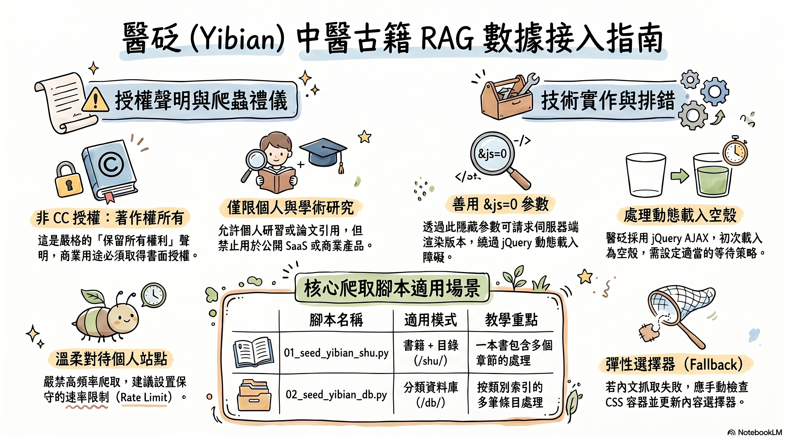

# tcm_corpus — 中醫古籍語料庫範例



> *把中醫古籍、藥典、病典灌進你的 RAG 知識庫。*

兩支腳本接入 [醫砭 yibian.hopto.org](https://yibian.hopto.org/) 的兩種路徑：
書籍（`/shu/`）與分類資料庫（`/db/`）。

## ⚠️ 先讀這個：授權與站方禮儀

醫砭頁尾標示「**著作權所有 ©2008～2026 智橐、醫砭、沈藥子**」——這是嚴格的
「保留所有權利」聲明，**不是 CC 開放授權**。本範例只示範技術，**不是邀請你
大量爬取**。

- ✅ **個人 / 課堂研究**：允許，建議事先寫信告知站方
- ✅ **學術論文引用**：允許，須註明出處
- ❌ **公開 SaaS / 商業產品**：必須先取得書面授權
- ❌ **大量抓取（每秒多請求）**：本站為個人 / 小團隊維運的 hopto.org 動態 DNS，
  禁止把人家家用網路搞掛
- 📖 服務條款：https://yibian.hopto.org/declare/?de=po
- 📖 著作權聲明：https://yibian.hopto.org/declare/?de=co

> **若你只是要做個人 RAG 知識助理問中醫題目** → 沒問題，但請設保守
> rate limit（worker 的 `DomainLimiter(default_max=1)` 已預設只有 1 個並發）。
> **若你打算對外發布應用** → 別用本範例的方式，去信沈藥子取得授權。

## 📂 兩支腳本

| 檔案 | URL pattern | 教學意圖 |
|------|-------------|----------|
| `01_seed_yibian_shu.py` | `/shu/?sno=43&cat=dir` | 「書籍 + 目錄」型 — 一本書多章節 |
| `02_seed_yibian_db.py` | `/db/?did=syp&cat=lei` | 「分類資料庫」型 — 多筆條目按類別 |

兩者站點相同、CSS 框架（`yb-*`）相同，但 URL pattern 與資料模型不同，
所以分為兩個 `source` 各自設定 `extractor_schema`。

## 🔧 與 ch10-spa 的關係

`ch10-spa` 教**SPA 概念與等待策略**；`tcm_corpus` 是它的**應用實戰**：

| 項目 | ch10-spa（CBETA） | tcm_corpus（醫砭） |
|------|-------------------|---------------------|
| 渲染方式 | 真 SPA（Vue/React-ish） | 傳統靜態 HTML + jQuery AJAX |
| `wait_until` | `load` | `networkidle`（AJAX 多次） |
| 授權 | CBETA 自訂（限非商業） | All rights reserved（更嚴格） |
| 內容性質 | 佛典 | 中醫古籍 + 藥典 + 病典 |

兩者都是「**初次 HTML 是空殼**」這個模式的具體案例。

## ⚡ 執行

```bash
cd project-playwright

# 種一本書（中醫很科學）的目錄
python examples/tcm_corpus/01_seed_yibian_shu.py            # 預設 sno=43
python examples/tcm_corpus/01_seed_yibian_shu.py --sno 12   # 換別本

# 種一個藥典/病典
python examples/tcm_corpus/02_seed_yibian_db.py             # 預設 syp/lei
python examples/tcm_corpus/02_seed_yibian_db.py --did hzm --cat bop

# 啟動 worker 真的去爬
python -m utils.worker.main

# 驗收
python ch09-rag-bridge/04_end_to_end_demo.py
```

## 🆘 疑難排解

### worker 顯示 `extracted 0 URLs`

醫砭的 TOC 由 jQuery AJAX 載入，**`xpd=8&js=0` 參數可請求非 JS 版本**
（已內建於 seed URL），讓 server 直接渲染 TOC。如果還是抓不到：

1. 用瀏覽器開該頁 + DevTools (F12) → Console
2. 跑 `document.querySelectorAll("a[href*='sno=']").length`
3. 若 0 → 站點改版了，需更新 `extractor_schema.list.item_selector`
4. 若 > 0 → 用 `document.querySelectorAll(...)[0].outerHTML` 查實際 HTML 結構

### 整段內文沒抓到、只剩標題

`extractor_schema.article.content_selector` 沒命中。本範例設了一串 fallback
（`article, main, [role='main'], .yb-db-content, ...`），但站方有可能用了
非標準的 wrapper（例如 `.yb-row > div:nth-child(3)`）。

修法：
1. 在瀏覽器找出實際內文容器的 selector
2. 修改 `02_seed_yibian_db.py` 內的 `content_selector`
3. 重跑該腳本（upsert 會更新 source 設定，不需要動 worker code）

### 站方回 403 / 抓不到內容

可能站方在 rate limit。**請暫停一陣子**，並考慮：
- 把 `DomainLimiter` 的 `default_max` 改為 1 + 加大 `POLL_INTERVAL_SEC`
- 或直接停手，去信站方說明你的研究 / 教學用途

## 📌 重點摘要

> 🎯 **動態載入不等於 React/Vue**——醫砭只是傳統靜態 + jQuery AJAX，
> 但對 `requests.get()` 一樣是空殼。
>
> 🎯 **`?js=0` 是隱藏的後門**——很多有 NOSCRIPT 重導向的站，
> 加 `&js=0` 可直接拿伺服器端渲染版本。
>
> 🎯 **小站要溫柔**——hopto.org 動態 DNS 通常是個人家用伺服器，
> 不要把人家網路打掛。
>
> 🎯 **「著作權所有」是預設**——沒看到明確的 CC 授權就當作不能商用。
